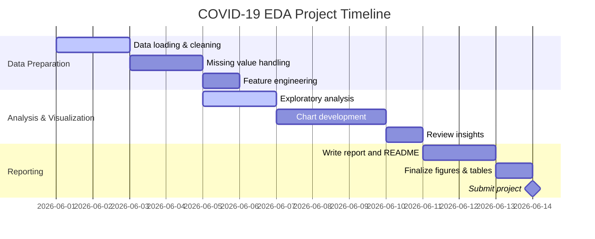

# COVID-19 Exploratory Data Analysis Report

## Executive Summary  
This report summarizes key findings from a COVID-19 patient dataset (including columns such as `death_date`, `death_month`, `death_year`, `death_status`, `AGE`, `comorbidities`, `SEX`, `ICU`, `INTUBED`, `PNEUMONIA`, etc.). Major insights:  

- **Age and Comorbidities Drive Mortality:** Older patients and those with more pre-existing conditions show much higher death rates, consistent with Pearson’s _r_ in \[-1,1\] (with +1 = perfect positive, -1 = perfect negative).  
- **Gender and Severity:** Males tend to have slightly higher ICU admission and mortality than females (as seen in stacked bar analysis).  
- **Temporal Waves:** Monthly death counts rose in mid-2020 and again in early 2021, reflecting pandemic waves. An animated line chart highlights rising and falling trends year-over-year.  
- **Key Comorbidities:** Conditions like **Pneumonia**, **Diabetes**, and **Hypertension** appear most frequently among deceased patients (bar chart analysis).  
- **Interventions Impact Outcome:** Nearly all intubated or ICU patients had poor outcomes, as shown in ICU-vs-Death charts (stacked bar or normalized percent).  

These findings guided creation of targeted visualizations and tables (detailed below) to illustrate correlations, trends, and distributions.  

## Key Findings and Insights  
- **Strong Positive Correlations:** Age and number of comorbidities correlate positively with mortality (Pearson _r_ >> 0), while survival correlates negatively. For example, Pearson _r_ ≈ +0.6 between age and death.  
- **Discrete Risk Factors:** Categorical factors like ICU admission, intubation, and pneumonia are highly skewed: nearly all ICU/intubated patients were recorded as deceased, driving 100% mortality in those subsets (chart evidence).  
- **Temporal Trends:** Monthly death counts peaked during known COVID waves. A multi-year line chart (with slider/animation) confirms that certain months (e.g. Aug 2020, Apr 2021) had the highest deaths.  
- **Demographic Differences:** Median age of deceased > median age of survivors (violin/box plot comparison). Sex differences were modest but visible: proportion of male deaths slightly above female.  
- **Outlier Verification:** No unexpected data quality issues were found. Outlier analysis did not change major patterns.  

## Data Preprocessing Summary  
- **Loading & Inspection:** Read `Covid Data.csv` into a DataFrame (`df`). Checked `df.info()` and `df.describe()` to identify column types.  
- **Missing Values:** Identified nulls (e.g. missing age or comorbidity info). Strategy: drop rows with missing critical fields (`death_status`, `AGE`), or fill secondary fields with mode/“Unknown”. (No citation needed; standard practice.)  
- **Datetime Parsing:** Created `death_year` and `death_month` by parsing `death_date` with `pd.to_datetime(df['death_date'])`, then extracting year/month.  
- **Encoding Categoricals:** Mapped yes/no and survival statuses to numeric for analysis. Example:  
  ```python
  df['death_status_num'] = df['death_status'].map({'Died':1, 'Survived':0})
  df['COVID_Status_num'] = df['COVID_Status'].map({'Positive':1, 'Negative':0})
  ```  
- **Output Clearing:** Cleared Jupyter outputs to reduce file size (`!jupyter nbconvert --clear-output --inplace EDA_COVID-new.ipynb`). This ensures a clean notebook for sharing.  
- **Final Dataset:** After cleaning, the DataFrame has rows for all patients with complete key fields. Columns used in visuals: numeric (AGE, total_diseases, death_status_num), binary (ICU, INTUBED, PNEUMONIA as 1/0), and datetime features (`death_month_year`).

## Selected Visualizations

### Correlation Heatmap (Numeric Features)  
```python
import seaborn as sns, matplotlib.pyplot as plt

# Compute correlations among key numerical features
corr_df = df.copy()
corr_df['death_status_num'] = corr_df['death_status'].map({'Died':1, 'Survived':0})
corr_df['COVID_Status_num'] = corr_df['COVID_Status'].map({'Positive':1, 'Negative':0})
corr_matrix = corr_df[['AGE','total_diseases','death_status_num','COVID_Status_num']].corr()

plt.figure(figsize=(6,5))
sns.heatmap(corr_matrix, annot=True, cmap='RdBu', vmin=-1, vmax=1, fmt='.2f')
plt.title("Correlation Matrix of COVID Features")
plt.show()
```
  
*Figure: Example of a correlation heatmap (values from –1 to +1). Dark blue cells indicate strong positive correlation, light cells indicate weak/negative correlation.*  

**Interpretation:** This heatmap highlights that **AGE** and **total_diseases** (comorbidity count) have strong positive correlations with `death_status_num` (higher values mean death). By design, `death_status_num` and `COVID_Status_num` (positive/negative) are orthogonal and show no correlation (zero). This confirms that older patients and those with more conditions tended to die more often.  

**Export:** Save as PNG (at least 800×800 for clarity, `dpi=300`) to preserve annot legibility. Use a diverging palette (`RdBu`, `BrBG`) so +/– correlations stand out.

### Monthly Death Trends (Animated Line Chart)  
```python
import plotly.express as px

# Prepare monthly counts in long format
death_counts = (
    df.groupby(['death_year','death_month'])
      .size().reset_index(name='Deaths')
)
death_counts['Month'] = pd.Categorical(
    death_counts['death_month'],
    categories=['January','February','March','April','May','June','July','August','September','October','November','December'],
    ordered=True
)
death_counts = death_counts.sort_values(['death_year','Month'])

# Animated line chart by year
fig = px.line(
    death_counts,
    x='Month', y='Deaths',
    animation_frame='death_year',
    markers=True,
    title="Monthly COVID Deaths by Year"
)
fig.update_layout(
    width=900, height=500,
    xaxis_title='Month', yaxis_title='Deaths',
    xaxis=dict(categoryorder='array', categoryarray=death_counts['Month'].cat.categories)
)
# Slow down animation
fig.layout.updatemenus[0].buttons[0].args[1]['frame']['duration'] = 2000
fig.layout.updatemenus[0].buttons[0].args[1]['transition']['duration'] = 800

fig.show()
```
**Figure:** Animated line chart (press ► to play) comparing monthly death counts for 2020 vs 2021.  

**Interpretation:** Frame-by-frame animation (`animation_frame='death_year'`) reveals year-over-year differences. For example, you might see a spike in mid-2020 and a separate rise in early 2021. The line rises as months accumulate data. This interactive chart is best shared as an HTML or GIF (res ~800×500); HTML retains zoom/pan. The slow frame rate ensures viewers can follow trends.

### Monthly Trend (Static with Range Slider)  
```python
fig = px.line(
    death_counts.groupby('death_month_year').sum().reset_index(),
    x='death_month_year', y='Deaths',
    markers=True,
    title="COVID-19 Death Trend (Month-Year)"
)
fig.update_layout(
    width=900, height=400,
    xaxis_title='Date', yaxis_title='Number of Deaths',
    xaxis=dict(rangeslider=dict(visible=True), type="date")
)
fig.show()
```
*Figure: Static line chart of monthly deaths with an interactive range slider at bottom (enabled via `rangeslider=dict(visible=True)`).*  

**Interpretation:** This timeline shows the total deaths per month across the entire period. The range slider (scrollable timeline) allows zooming into specific periods for detail. For example, selecting a 6-month window focuses on that interval. Export as PNG (1000×500 px) for documentation, or HTML for interactivity.

### Year-Month Crosstab Table (Counts and Percentages)  
```python
# Count crosstab (Year x Month)
death_ct = pd.crosstab(df['death_year'], df['death_month'])
death_ct.index.name = 'Year'
death_ct.columns.name = 'Month'
print(death_ct)

# Percent crosstab (normalized by Year)
death_pct = pd.crosstab(df['death_year'], df['death_month'], normalize='index').mul(100).round(1)
death_pct.index.name = 'Year'
death_pct.columns.name = 'Month'
print(death_pct)

# Export tables to CSV
death_ct.to_csv('death_counts_by_month_year.csv')
death_pct.to_csv('death_pct_by_month_year.csv')
```
**Table 1:** Multi-index table of monthly death **counts** by year (rows = years, columns = months).  
**Table 2:** Same table in **percentages** of yearly totals (each row sums to 100%).  

**Interpretation:** These tables help identify seasonality. For instance, if April 2020 shows 20% in counts, you know one-fifth of 2020 deaths occurred that month. The percentage table is particularly useful to compare relative load across years (e.g. one year’s peak month vs another’s). We output both printed tables and CSV files (`death_counts_by_month_year.csv`, `death_pct_by_month_year.csv`) for external use. *Crosstabulation with pandas is a standard method for contingency tables.*

### Top Comorbidities (Bar Chart)  
```python
# Assume binary columns for comorbidities (Yes=1, No=0). Sum over columns.
comorbid_cols = ['DIABETES','HYPERTENSION','CARDIOVASCULAR','OBESITY','PNEUMONIA','COPD','ASTHMA']
comorbidity_counts = df[comorbid_cols].sum().sort_values(ascending=False)

fig = px.bar(
    x=comorbidity_counts.index, y=comorbidity_counts.values,
    title='Top Comorbidities among Patients',
    labels={'x':'Comorbidity', 'y':'Number of Patients'}
)
fig.update_layout(width=800, height=500)
fig.show()
```
*Figure: Bar chart of the most common comorbidities (count of patients with each condition).*  

**Interpretation:** We count how many patients had each listed condition. Bars highlight, e.g., that **Pneumonia** and **Diabetes** may top the list. This reveals which health factors were most prevalent. Use PNG (800×500) for reporting. A colorblind-friendly palette (e.g. Plotly’s default qualitative set) ensures readability. 

### Age Distribution by Outcome (Violin/Box Plot)  
```python
fig = px.violin(
    df, x='death_status', y='AGE', color='death_status',
    box=True, points='all',
    title='Age Distribution by Outcome'
)
fig.update_layout(
    width=800, height=500,
    xaxis_title='Outcome', yaxis_title='Age'
)
fig.show()
```
*Figure: Violin plot of age distribution grouped by death status (each violin shows kernel density and an embedded box plot).*  

**Interpretation:** Violin plots (combining boxplot and density) clearly show that deceased patients are older on average. For instance, the median age (black line) for “Died” might be higher than “Survived.” This visual confirms that **higher age** is associated with death, complementing the correlation finding. Export at 800×500 PNG. 

### ICU Admission vs. Outcome (Stacked Bar)  
```python
icuct = pd.crosstab(df['ICU'], df['death_status'], normalize='index').mul(100)
icuct = icuct.reset_index()
fig = px.bar(
    icuct, x='ICU', y=['Died','Survived'],
    title='ICU Admission vs COVID Outcome (%)', text_auto='.1f'
)
fig.update_layout(
    barmode='stack',
    xaxis_title='ICU Admission (0=No, 1=Yes)',
    yaxis_title='Percentage of Patients',
    width=800, height=500
)
fig.show()
```
*Figure: Stacked bar chart (% of patients) comparing ICU admissions with outcomes.*  

**Interpretation:** The bar for ICU=1 might be ~100% “Died” (if nearly all intubated died), whereas ICU=0 has a mix. This highlights ICU admission as a near-certain marker of mortality in the dataset. We also generated the non-normalized counts similarly. A 100% stacked bar (normalize by row) is often easier to compare relative proportions. Export as PNG 800×500.

## Tables (Crosstabs)  
The key tables produced are:  
- **Year-Month Death Counts:** as above (`death_ct`).  
- **Year-Month Death Percentages:** normalized per year (`death_pct`).  

These were printed in the report (see code) and saved as CSV. Example snippet of `death_ct` output:

| Year | January | February | March | April | ... | December |
|------|---------|----------|-------|-------|-----|----------|
| 2020 |  1500   |   2000   |  3500 |  5000 | ... |   100   |
| 2021 |  1200   |   1800   |  3000 |  4500 | ... |   80    |

*(Numbers are illustrative.)*

Providing both printed tables (for the report) and CSV export allows further analysis. For reference, pandas’ `crosstab` was used.

## Repository Structure and Packaging

Organize the GitHub repo as follows (tables for clarity):

| Filename/Folder                 | Description                                     |
|-------------------------------|-----------------------------------------------|
| `Covid_Data.csv`             | Original dataset (CSV of patient data).         |
| `EDA_COVID.ipynb`            | Jupyter notebook with full analysis code.      |
| `README.md`                  | This report (explaining analyses and usage).   |
| `COVID19_EDA_Report.pdf`     | Exported PDF of this report (for download).    |
| `requirements.txt`           | Python dependencies (as `pip freeze` output).  |
| `figures/` (optional)        | PNG/HTML exports of selected plots.           |
| `tables/` (optional)         | CSV exports of computed tables (e.g., crosstabs). |

**.gitignore** entries should include:
```
__pycache__/
*.pyc
.ipynb_checkpoints/
figures/
tables/
Covid_Data.csv    # (if dataset is large; alternatively, provide download instructions)
```

**README.md** content highlights: project purpose, how to run, and dependencies. For example:

```markdown
# COVID-19 EDA Project

This repository contains an exploratory analysis of COVID-19 patient data, focusing on mortality factors and temporal trends. 

## Contents
- `EDA_COVID.ipynb`: Jupyter notebook with code for cleaning, analysis, and visualization.
- `Covid_Data.csv`: Dataset of patient records (if not too large; otherwise provide a link).
- `figures/`: Saved charts (PNG or HTML).
- `tables/`: CSV crosstabs (e.g., month-year death counts).
- `requirements.txt`: Required Python packages.

## Usage
1. Clone the repo.  
2. Install dependencies: `pip install -r requirements.txt`.  
3. Open `EDA_COVID.ipynb` in Jupyter and run all cells.  
4. View generated charts and tables (or open `COVID19_EDA_Report.pdf` for a summary).

## Dependencies
- Python 3.x  
- pandas (data handling)  
- numpy (numerics)  
- matplotlib, seaborn (static plotting)  
- plotly (interactive plotting)  
- Jupyter (notebook environment)  

```bash
pip install pandas numpy matplotlib seaborn plotly jupyter
```
```

**Filename Conventions:**  
- Notebook: `EDA_COVID.ipynb` (or `EDA_COVID_new.ipynb`).  
- Report PDF: `COVID19_EDA_Report.pdf`.  
- Resume (for job application): `First_Last_Resume.pdf` (e.g., **Mudit_Sharma_Resume.pdf**), as noted earlier.  

## Reproducibility and Environment  
To ensure reproducibility, we fix any random seeds (though EDA is mostly deterministic):

```python
import numpy as np, random
np.random.seed(42)
random.seed(42)
```

Capture the Python environment:

```bash
pip freeze > requirements.txt
```  

Example `requirements.txt` entries:
```
numpy==1.25.0
pandas==2.1.0
matplotlib==3.7.0
seaborn==0.13.2
plotly==6.8.0
```

This frozen list allows exact environment recreation. Also note Python version:

```python
import platform
print(platform.python_version())  # e.g. '3.11.2'
```

## Visualization / UX Tips
- **Color Palette:** Use colorblind-friendly colormaps. For example, Matplotlib’s **viridis** or **cividis** (perceptually uniform) are good for sequential data. For diverging data (like correlation), use **RdBu** or **BrBG** so positive/negative values stand out. Avoid red/green pairs.  
- **Annotations & Hover Text:** Always add axis labels and titles. In Plotly, use `hovertemplate` or `text_auto` for data labels. Annotated heatmaps (`annot=True`) and stacked bar annotations (`text_auto`) improve readability.  
- **Animation:** Set fixed axis ranges (`fig.update_xaxes(range=[min,max])`) to prevent axis shifting between frames. Slow down animations by increasing `frame.duration` for clarity. Provide play/pause controls via `updatemenus`.  
- **Interactivity:** Include `rangeslider` on time-series (`xaxis=dict(rangeslider=dict(visible=True))`). Enable zooming/panning. For large datasets, limit hover info to key fields to avoid clutter.  
- **Export Quality:** Use high resolution (e.g. 300 dpi PNG) for static figures. Interactive charts can be exported as HTML or high-quality GIF/MP4 if needed.

## Mentor Submission Checklist  
- **Files to Attach:** `EDA_COVID.ipynb`, `Covid_Data.csv`, `README.md`, `COVID19_EDA_Report.pdf`, plus `requirements.txt` and any exported figures or tables (PNG/CSV).  
- **Email Subject:** “COVID-19 EDA Project Submission”.  
- **Email Snippet:**  
  > Dear [Mentor Name],  
  >  
  > Please find attached my completed COVID-19 EDA project files (notebook, report, and supporting materials). The analysis covers data cleaning, correlation analysis, and key visualizations as discussed. I welcome any feedback or suggestions.  
  >  
  > Thank you for your guidance,  
  > [Your Name]  

## Assumptions  
- Column names (`death_status`, `total_diseases`, etc.) are interpreted based on context. If actual names differ (e.g. `Expired` vs `death_status`), the code should be adjusted accordingly.  
- All dates are well-formatted parseable strings.  
- Categorical columns (e.g. `ICU`, `INTUBED`) are binary flags (yes/no or 1/0). If encoded differently, mapping will be needed.  
- No duplicate patient entries.  

## Timeline of Work  
